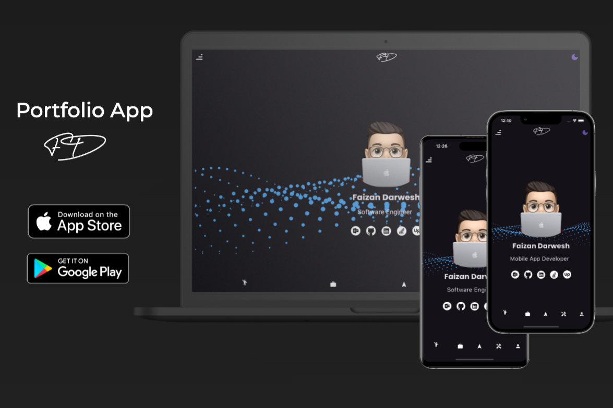

# Portfolio App

Welcome to the Portfolio App! This project showcases my skills, projects, and achievements. It is built using Flutter and supports multiple platforms, including Android, iOS, and the web. The app features a clean and modern design with support for both dark and light modes.

## Features

- **Multi-Platform Support:** Available on Android, iOS, and the web.
- **Dark and Light Modes:** Easily switch between themes to suit your preference.
- **State Management:** Utilizes Riverpod for efficient state management and theme switching.
- **Firebase Integration:** Hosted on Firebase for backend support and data management.

## Tech Stack

- **Flutter:** For building a responsive and beautiful user interface.
- **Dart:** The programming language used to power the app.
- **Riverpod:** State management solution for handling app state and theming.
- **Firebase:** Provides backend support, including authentication and data storage.

## Installation

1. **Clone the Repository:**

    ```bash
    git clone https://github.com/faizandarwesh/portfolio-app.git
    ```

2. **Navigate to the Project Directory:**

    ```bash
    cd portfolio-app
    ```

3. **Install Dependencies:**

    ```bash
    flutter pub get
    ```

4. **Run the App:**

    - For Android:

        ```bash
        flutter run
        ```

    - For iOS:

        ```bash
        flutter run -d ios
        ```

    - For Web:

        ```bash
        flutter run -d chrome
        ```

## Screenshots

### iOS
<p align="center">
  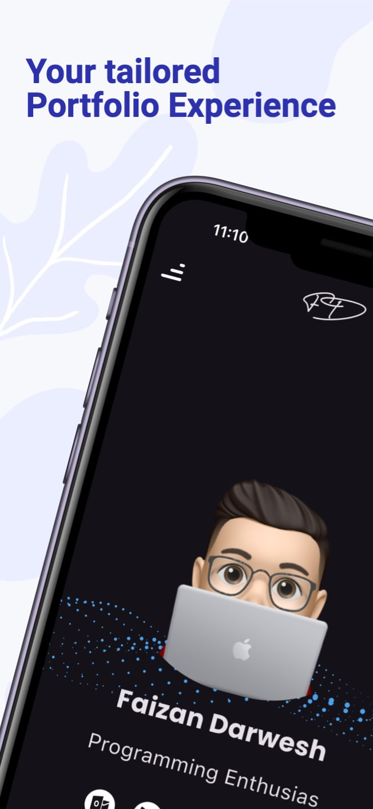
  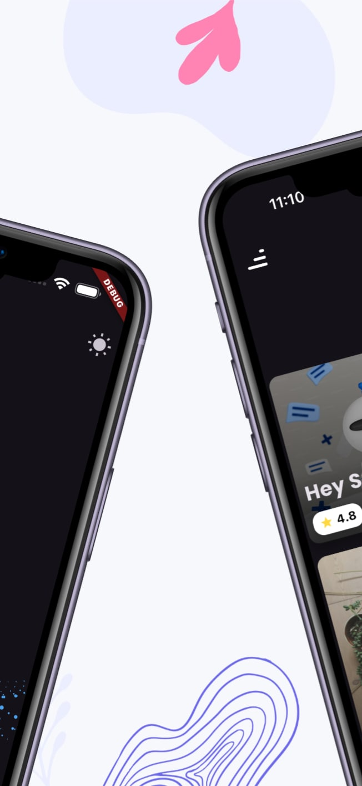
     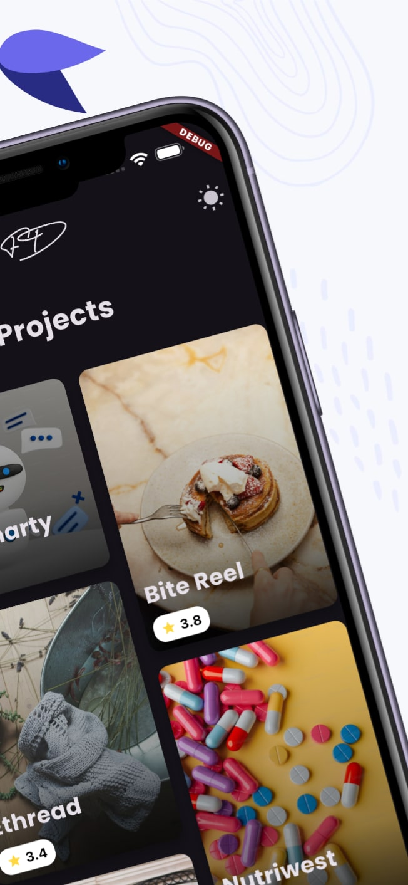
     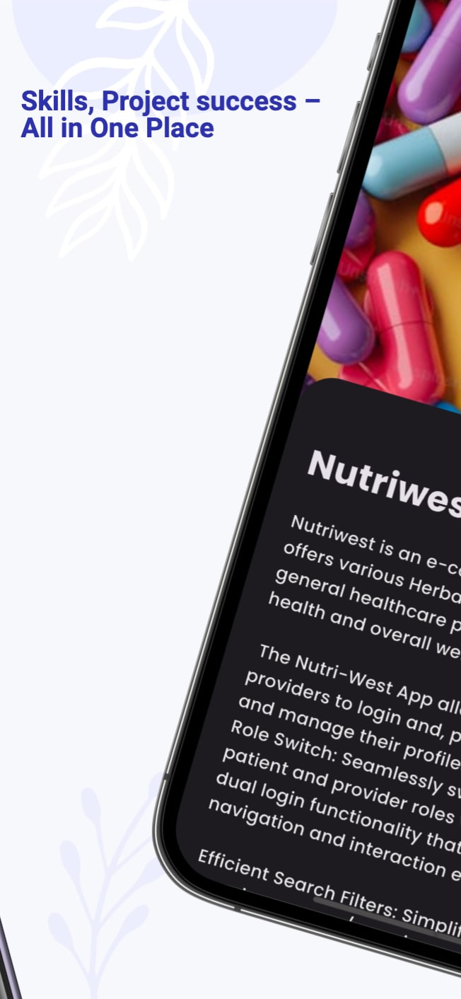
     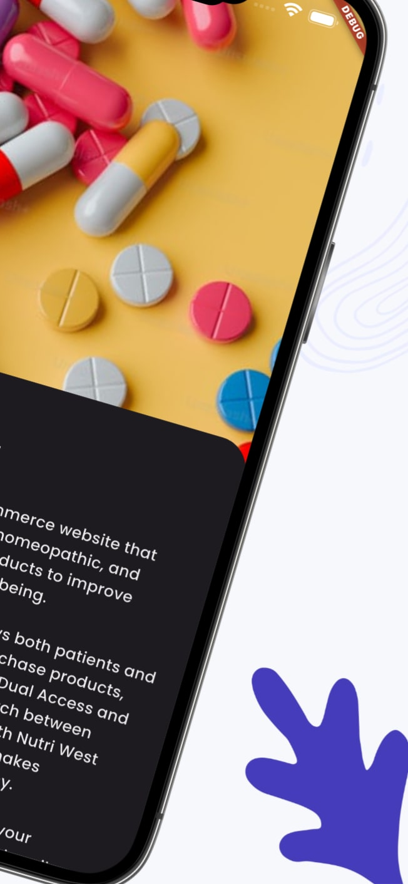
 
 
</p>

### Android
<p align="center">
  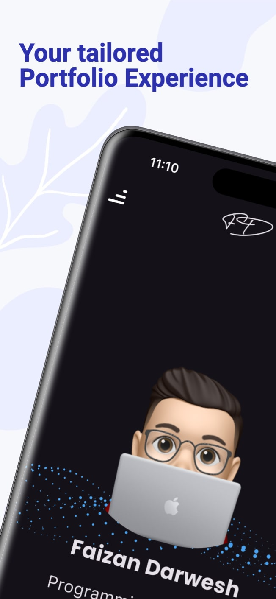
  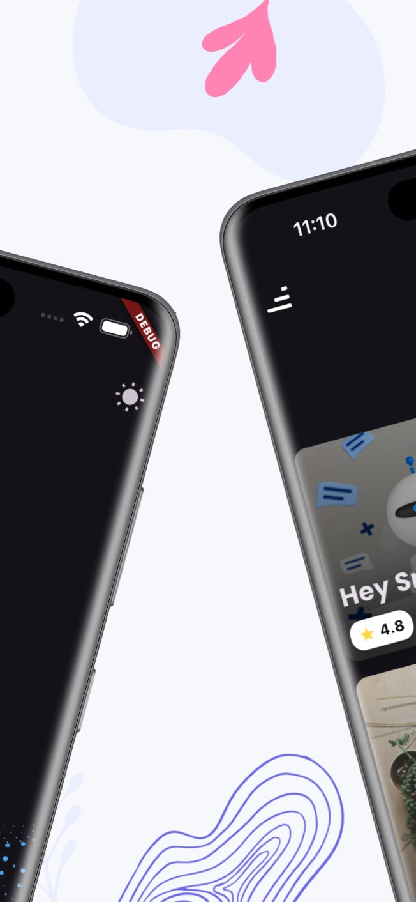
     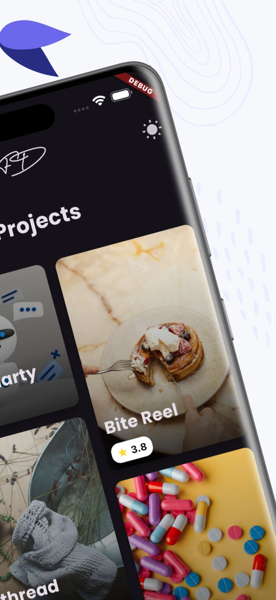
     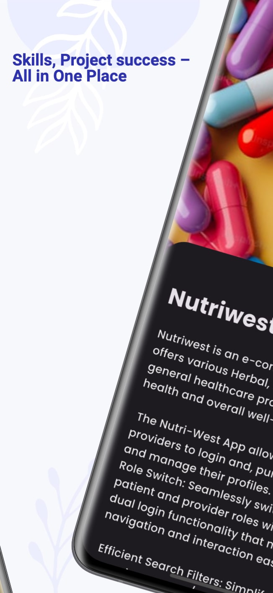
     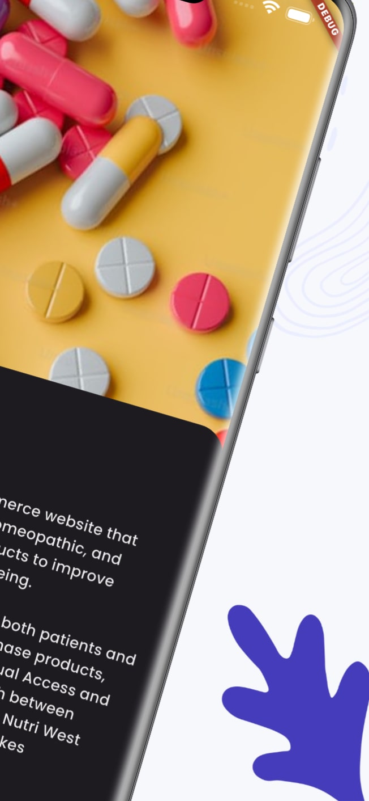
 
 
</p>

<!--

-->
## Demo

<!--! Check out the app in action: [Watch Demo](https://www.youtube.com/watch?v=yourvideolink) --->

COMING SOON!

## Contributing

If you'd like to contribute to this project, please fork the repository and submit a pull request with your proposed changes.

## License

This project is licensed under the MIT License. See the [LICENSE](LICENSE) file for details.
